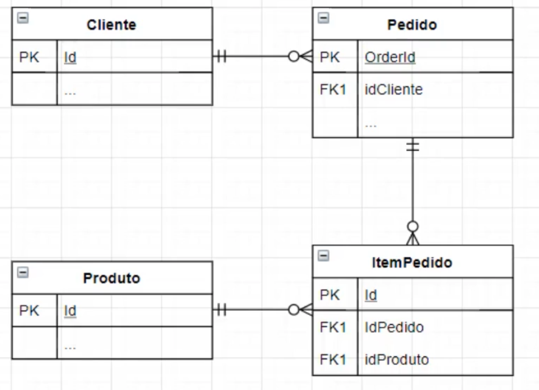

# Spring Data e Acesso a Dados

- Configurar e conecta-se a um banco de dados
- Acessar banco de dados em memória através do browser
- Utilizar SQL junto com o Spring JDBC para fazer operações
- Mapear entidades JPA e utilizar o EntityManager para realizar operações na base de dados
- Trabalhar com JPA Repositories
- Fazer consultas utilizando Query Methods e @Query

## Modelo de Negócio


## Comandos utilizados no Banco de Dados - H2
```
create table cliente (
   id int not null primary key,
   nome varchar(100)
); 
```

```
select * from cliente;
```
