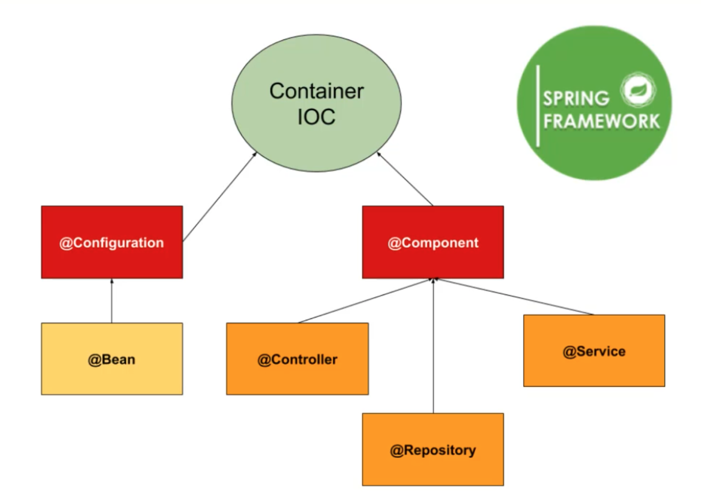

# Container IOC

### Container IOC - Inversor Of Controller (Inversão de controler)
- contexto da aplicação

@Configuration
- classes de configuração
- essas classes fazem parte do container

@Bean
- também irá fazer do container

@Component
- classe que contem metodos

@Controller
- controllers da aplicação

@Repository
- banco de dados

@Service
- classes de serviços
- regras de negocios

# Injeção de Dependencias

### O que é e como funciona no Spring
- padrão de projeto, onde é delegado a outras classes ou container que instance minhas classes e dependencias e injeta nas classes que preciso

### Camada Service
- contem as regras de negocio 